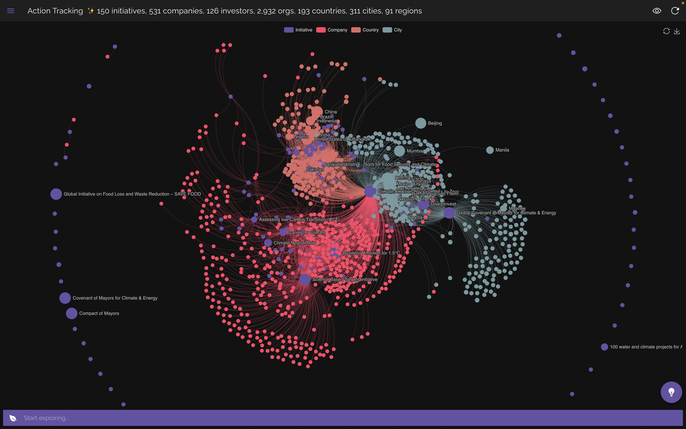

<h1 align="center" style="border-bottom: none">ActInsight</h1>

  

<h2 align="center" style="border-bottom: none">Better Insights into Collective Climate Actions</h2>

 

Watch the project introduction <a href="https://youtu.be/wrV9EJzssGc" target="_blank">video</a>
  

    

  

Visit the ActInsight <a href="https://actinsight.org" target="_blank">website</a>  

## Table of Contents

- [Challenge](#challenge)
- [Solution](#solution)
- [Documentation](#documentation)
- [Contributing](#contributing)
- [License](#license)

 

## Challenge

The currently fragmented, insufficient and incompatible sources building the climate data framework remain a critical threat to a successful outcome of the [2023 Global Stocktake](https://unfccc.int/topics/global-stocktake) for the [Paris Agreement](https://unfccc.int/process-and-meetings/the-paris-agreement/the-paris-agreement).

While we observe an increasing amount of participation, effective ways of connecting, visualizing and analysing actors patterns & impact, within the overall climate initiatives, remain limited.

 

## Solution

<a href="https://actinsight.org" target="_blank">ActInsight</a> contributes to the collective efforts to integrate, analyse and visualize data across actors, at all levels, businesses and civil societies, and to understand their contribution and impact within the various climate initiatives.

Added-value

- Better insights into collective climate actions
- Interactive & visual approach to understand trends & patterns between actors
- The platform is open and accessible to everyone. All code & data are open source, to encourage further collaboration & impact
- Live data-sharing API, opening the platform's data layer for better collaboration, while leveraging climate data interoperability by following the [OpenClimate Schema](https://github.com/Open-Earth-Foundation/OpenClimate-Schema), designed & maintained by the [OpenEarth Foundation](https://www.openearth.org/) team

Key features

- Live search & insights
- Interactive visualization, mapping and aggregation of various data dimensions & relevant relationships
- Dynamic mapping of underlying information, adjusting graph complexity for a better user experience - aiming to better highlight actor interactions, collaboration, targets & commitments across initiatives and geographies

Data sources

- [UNFCCC Climate Action](https://climateaction.unfccc.int/)
- [Net Zero Tracker](https://zerotracker.net/)
- [Global Covenant of Mayors](https://www.globalcovenantofmayors.org/)
- [WikiData pySPARK custom queries](https://query.wikidata.org/)

 

## Documentation

- For an overview of the project, please watch the <a href="https://youtu.be/wrV9EJzssGc" target="_blank">introduction video</a>
- To learn more about the platform's features & navigation, we recommend to follow the interative "quick tour", directly accessible on the <a href="https://actinsight.org" target="_blank">website</a> home page.
- For the data-sharing API, please refer to the <a href="https://actinsight.org/assets/schema/ActInsight_API_quick_start.pdf" target="_blank">quick-start document</a>, which includes examples for R, Python and the Web.

 

## Contributing

Please contribute using [Github Flow](https://guides.github.com/introduction/flow/). Create a branch, add commits, and [open a pull request](https://github.com/shadowboxingskills/ActInsight/compare/).

If you are interested to get further involved with the <a href="https://valuegrid.io" target="_blank">ValueGrid</a> team on this project, please [contact us](mailto:nawel@valuegrid.io?subject=[GitHub]%20ActInsight).

 

## License

Usage is provided under the GPLv3 license.
See [LICENSE](https://github.com/shadowboxingskills/ActInsight/blob/master/LICENSE) for full details.
